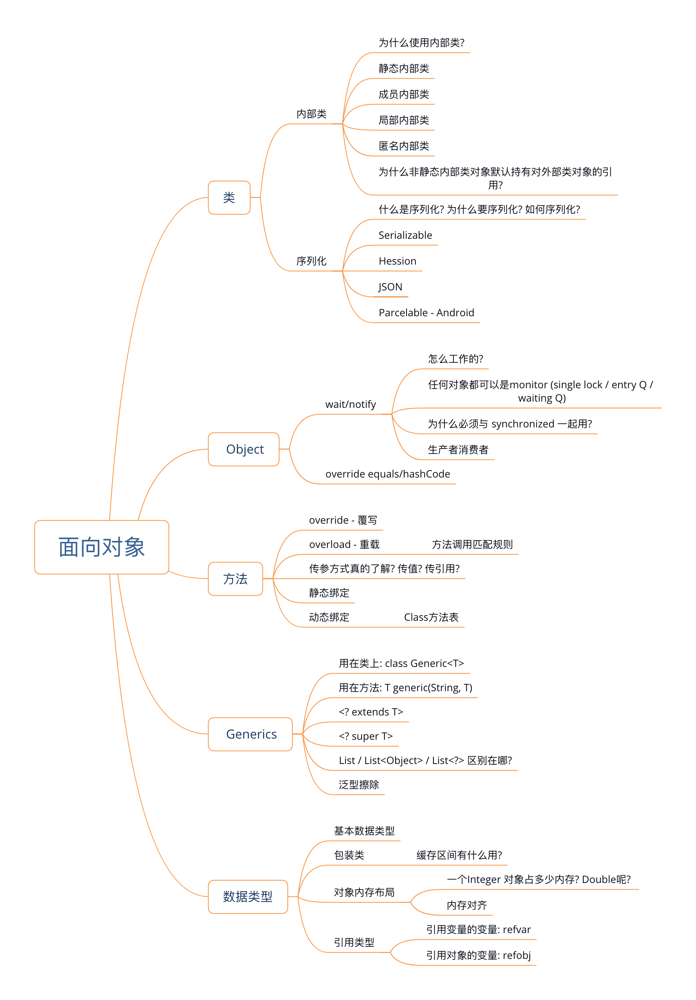

## 第二章 面向对象




## Class

* 内部类

  * 使用内部类的3 个原因 [Nested Class](https://docs.oracle.com/javase/tutorial/java/javaOO/nested.html)
    1. 内部类可以让具有相关逻辑的代码放到同一个类中: 如果某个类只被另外一个类用到,那么这个类可以被定义为另外一个类的内部类.其他类不会关心到这个类的存在.
    2. 内部类可以增强内聚: (跟 1 类似) 如果有 A-B 两个类, 因为 A类里面某个成员变量需要被 B类访问到, 则 A类的成员变量不能被定义为 private; 如果把 B类定义为 A 类的一个内部类,则 A类的成员变量可以直接被定义为 private . 这些成员变量就不会被其他类访问到.
    3. 内部类有更好的可读性和可维护性. 被定义为内部类在读代码的时候距离被用到的地方更近.
    
  * 内部类的分类: 按照定义方式分为 4 类. 静态内部类 / 成员内部类 / 局部内部类 / 匿名内部类.

  * 其中: 除了静态内部类之外, 其他 3 种内部类都默认持有对外部类对象的引用. ([TBC-1 Synthetic Field](<https://www.baeldung.com/java-synthetic>): *When compiled, **any inner class will contain a synthetic field which references the top level class. Coincidentally, this is what makes possible to access the enclosing class members from a nested class.***)

    原因是: (非静态) 内部类对象默认持有对外部类对象的引用, 是因为: 内部类在被 jdk 编译之后生成的 class 的构造方法中, 默认增加了一个指向外部类的变量, 并在构造方法中进行赋值. 因此: 内部类对象默认持有对外部类对象的引用; 但外部类对象默认不持有对内部类对象的引用. [参考这里](<https://www.logicbig.com/tutorials/core-java-tutorial/java-language/inner-class-constructor.html>)

  * 内部类共同的特点: 编译之后的类名中都会带有 '\$'. 局部内部类和匿名内部类还会带有数字.
    * 其中, 静态内部类和成员内部类的命名方式为: outer_class_name\$inner_class_name.class
    * 局部内部类的命名方式为: outer_class_name\${1}inner_class_name.class
    * 匿名内部类的命名方式为: outer_class_name${1}.class — 因为匿名内部类没有名称所以只有数字

  1. 静态内部类

     定义方式: 定义在外部类中. [private] static class StaticInnerClass { .. }

     用法特点:  

     ​	可以访问外部类的私有静态字段和私有静态方法. 通过 `OuterClass.StaticInnerClass()` 访问.

     ​	不可以直接访问外部类的成员变量

     ```java
     // Outer class 中访问 StaticInnerClass
     StaticInnerClass staticInnerClass = new StaticInnerClass();
     // 其他类中访问 StaticInnerClass, StaticInnerClass 必须不是 private 才能在其他类中访问
     OuterClass.StaticInnerClass staticInnerClass = new OuterClass.StaticInnerClass();
     ```

  

  

  2. 成员内部类

     定义方式: 定义在外部类中. [private] class InstanceInnerClass { .. }

     用法特点: 可以直接访问外部类的私有成员变量. 通过 `outerClassObject.new InstanceInnerClass()` 访问.

     **在成员内部类中不能定义 static 类型的变量, 但可以定义 static final 类型的常量**

     ```java
     OuterClass outerClass = new OuterClass();
     InstanceInnerClass innerClassObj = new outerClass.new InstanceInnerClass();
     ```

  

  ​		- 当在成员内部类中访问外部类的方法(比如 foo 方法)时, 可以直接调用 foo(); 也可以 `OuterClass.this.foo()`. 他们之间的区别在于后者明确调用的是外部类的 foo 方法. 如果内部类中没有定义 foo 方法,则两个没有区别; 如果内部类中也有 foo 方法,则会调用内部类的 foo 方法.

  

  Mini-Summary:

  | 内部类类型 | 访问外部类静态常量 | 访问外部类静态变量 | 访问外部类成员变量                 |
  | ---------- | ------------------ | ------------------ | ---------------------------------- |
  | 静态内部类 | Yes                | Yes                | No (需要 new 外部类的实例然后访问) |
  | 成员内部类 | Yes                | Yes                | Yes                                |

  

  3. 局部内部类

     定义方式: 定义在方法内部. class MethodClass { .. }

     用法特点: 跟成员内部类一样, 可以直接访问外部类的成员变量

     **不能在方法块中定义 interface.**

     **不能在局部内部类中定义静态的变量或方法, 但可以定义 static final 的常量**

     **不能在局部内部类中访问方法块中的变量, 但可以访问 final 常量**

     

  4. 匿名内部类

     定义方式: 定义在方法内部. (new Thread() {}).start();

     用法特点: 让代码变的简洁. 用法和局部内部类一样除了他没有类名. 如果这个类仅仅会被用到一次, 就可以使用匿名内部类.

     常见于定义按钮的回调.

     ```Java
     label.setOnClickListener(new OnClickListener() {
         @Override
         public void onClick(View v) {
            // Handle OnClick event here             
         }
     });
     ```

     因为回调这种事件需要处理的频率非常高,如果不用匿名内部类的话我们需要为每个按钮都定义一个类,这样代码冗余太严重.

     

     | 内部类类型 | 访问外部类所有类型字段 | 访问局部常量                                                 | 访问局部变量 |
     | ---------- | ---------------------- | ------------------------------------------------------------ | ------------ |
     | 局部内部类 | Yes                    | Yes <br /> (从 1.8 开始, 还允许访问 effective final 类型的变量) | No           |
     | 匿名内部类 | Yes                    | Yes                                                          | No           |

     有人说匿名内部类有点 closure 的意思.我目前还没感受到他们之间有什么明确的相似性.

     [JavaScript closures](<https://stackoverflow.com/questions/111102/how-do-javascript-closures-work>)

* 关于序列化
  
  * **什么是序列化? 为什么要序列化? 如何序列化?**
    
    对Java 来说,任何在运行时访问的对象都是存在JVM 的内存当中,当需要把某些对象通过网络发送给其他计算机的时候, 存在内存当中的 Java 对象是不能直接传递给其他计算机的. 这个时候就需要序列化一下. 
    
    **那什么是序列化呢? 为什么序列化一下就可以传递了呢?**
    
    我们知道, 通过网络传输的任何数据都是字节流或者说是数据流,或者干脆简单的理解成二进制. 序列化就是把 Java 对象变成一段二进制数据流的过程.
    
    **那么如何序列化呢?**
    
    常见的序列化方式有三种, Java 原生的 Serializable 接口; 第三方的Hession 和 JSON. Android 里面还有一种`Parcelable`.
    
    **序列化的本质是什么?**
    
    第一: 提供方把内存中的对象转化成某种约定好格式的数据流(可以是纯文本, 比如 JSON), 我们称之为序列化; 第二: 使用方读取接收到的数据流,按照约定好的格式解析出数据流当中的内容,然后组装成一个对象,就可以在自己的 JVM 运行时使用了.
    
    **序列化还有哪些使用场景?**
    
    持久化时也可以使用,比如当需要把对象存到磁盘文件或数据库中的时候,也会用到序列化.
    
    
  
  1. Serializable
  
     1. Serializable 接口
  
        ```java
        public class Person implements Serializable {
            private String name;
            private int age;
          
            public Person(String name,  int age) {
                this.name = name;
                this.age = age;
            }
        }
        ```
  
        上面代码中 Person 类实现了 Serializable 接口. 这个 Serializable 接口是一个标记性接口, 代表这个类的对象可以被序列化. 仅此而已,没有抽象方法需要实现.
  
        
  
     2. 序列化
  
         `ObjectOutputStream.writeObject(obj)` 这个方法将 obj 这个对象写到对应的输出流中.
  
        ```java
        // personFile 是一个 File 的对象. 具体代码在 demo 项目中
        try (FileOutputStream fileOutputStream = new FileOutputStream(personFile);
                    ObjectOutputStream objectOutputStream = new ObjectOutputStream(fileOutputStream);) {
                    objectOutputStream.writeObject(person);
                    System.out.println("person file path: " + personFile.getAbsolutePath());
        } catch (IOException ioe) {
            ioe.printStackTrace();
        }
        ```
  
        
  
     3. 序列化父类字段了吗?
  
        ```java
        public class Student extends Person {
            private int grade;
            public Student(String name, int age, int grade) {
                super(name, age);
                this.grade = grade;
            }
        
            public int getGrade() {
                return grade;
            }
        }
        ```
  
        Student 是 Person 的一个子类. 这个情况下当用类似的方法序列化 Student 对象的时候,其父类的成员变量也会被序列化. 
  
        ```java
        // 如果把 Person 类中 implements Serializable 去掉, 在 Student 类中加上 implements Serializable
        public class Student extends Person implements Serializable {
            private int grade;
            public Student(String name, int age, int grade) {
                super(name, age);
                this.grade = grade;
            }
        
            public int getGrade() {
                return grade;
            }
        }
        ```
  
        这种情况仍然可以序列化成功. 只不过, 父类(Person类)的成员变量不会被序列化.
  
        
  
     4. 哪些成员变量可以被序列化? 哪些不行?
  
        Non-transient / non-static 的可以被序列化.
  
        如果想要序列化 transient 成员变量, 可以在定义他的类中, 加一对方法:private void writeObject(ObjectOutputStream objectOutputStream) throws Exception`/private void readObject(ObjectInputStream objectInputStream) throws Exception
  
        这两个方法都是 private 的, 既不是 override 的 Object 类,又不是在 Serializable 接口中定义的,那他是怎么在序列化和反序列化过程当中被调用的呢?
  
        是被这两个类(ObjectOutputStream / ObjectInputStream) 反射调用的.
  
        
  
     5. 我想指定序列化哪些成员变量, 怎么办? Externalizable 接口
  
        当某个类实现`Externalizable` 接口就可以完全指定这个类当中哪些成员变量要被序列化.
  
        这种方式可以序列化任何类型的变量或常量, 包括`Serializable`接口默认不会序列化的`transient` 和 `static` 类型的变量.
  
        需要实现的方法为: `writeExternal(ObjectOutputStream)` / `readExternal(ObjectInputStream)`
  
        在这两个方法中分别调用 out.writeXXX 和 in.readXXX 来按照既定的顺序来保存对象的数据和读取数据并设定到对象当中.
  
        
  
        ```java
            @Override
            public void writeExternal(ObjectOutput out) throws IOException {
                out.writeUTF(this.getName());
                out.writeInt(grade); // private transient int grade;
                out.writeUTF(SCHOOL); // private static String SCHOOL = "XX_SCHOOL";
            }
        
            @Override
            public void readExternal(ObjectInput in) throws IOException, ClassNotFoundException {
                String name = in.readUTF();
                this.setName(name);
                int g = in.readInt();
                SCHOOL = in.readUTF();
                this.grade = g;
            }
        ```
  
        
  
        使用方, 与`Serializable`接口一样, 仍然需要用 `FileOutputStream` / `ObjectOutputStream` 来做序列化; 以及用 `FileInputStream` 和 `ObjectInputStream` 来做反序列化.
  
         
  
     6. 反序列化 `ObjectInputStream.readObject()`
  
        ```java
        FileInputStream fileInputStream = new FileInputStream(xFile);
        ObjectInputStream objectInputStream = new ObjectInputStream(fileInputStream);
        objectInputStream.readObject(); // 此处读取到序列化的 Object
        ```
  
        
  
     7. 都说反序列化不会调用构造方法, 那反序列化时怎么产生的对象? [看这里](<https://howtodoinjava.com/java/serialization/how-deserialization-process-happen-in-java/>)
  
        反序列化并不是不会调用构造方法, 而是会调用继承链当中第一个没有实现`Serializable`接口的那个类的无参数构造方法.
  
        默认情况下, 一个对象的正常序列化实现方式是这个类的整个继承链当中所有的类都可被序列化. 这样才能保证成员变量可以正常的序列化与反序列化. (参见第3点: 序列化父类字段了吗?)
  
        如果在继承链当中有一个类没有实现 Serializable 接口, 那么他必须提供无参数构造方法, 否则在反序列化的时候会出现 `no valid constructor` 异常.
  
        如果整个继承链中都实现了 `Serializable` 接口的话, 那么默认调用的构造方法是所有类的父类也就是 Object 类, 他的无参数构造方法会被调用, 生成一个对象之后, 先把 static 变量赋值给这个对象(?static 是属于类的为什么会给这个对象?), 再调用 readObject 方法把读到的数据设置到这个对象当中去.
  
        除了这个无参数构造方法之外,其他任何构造方法都不会被执行.
  
        
  
        书上明确写了"使用Java原生序列化需要注意， Java反序列化不会调用类的无参构造方法"。 我的理解是，默认情况(没有父类或父类也实现了 Serializable 接口)确实不会调用类的无参构造, 因为这种情况他调用的是 Object 的无参构造. 
  
        
  
     8. 序列化文件里面存了什么?
  
        在对象序列化后保存的文件里面, 存着类的元信息, 成员变量的类型以及成员变量的值.
  
        反序列化的时候会从序列化文件当中读取到这个类的元信息, 元信息里面记录了这个对象所属的类是实现了 Serializable 接口还是 Externalizable 接口
  
        如果是 implements Serializable 接口, 则执行流程如#7 点所述.
  
        如果是 implements Externalizable 接口, 则要求被反序列化的类必须有无参数构造方法或者没有任何构造方法. (即: 反序列化过程会调用自己的无参构造方法或 Object 的无参构造.). 这种情况父类有无参构造不会被调用, 并且如果只有父类有无参构造自己类没有的话, 反序列化会抛出 no valid constructor 的异常.
  
        
  
        - [序列化文件内容分析](<https://www.cnblogs.com/fernandolee24/p/5682738.html>)
  
        - [Oracle 序列化协议](<https://docs.oracle.com/javase/8/docs/platform/serialization/spec/protocol.html>)
  
        
  
     9. serialVersionUID 是干什么的?
  
        当 implements Serializable 接口之后, 建议设置 serialVersionUID. 如果不设置, 编译器会根据类的内部实现自动生成一个 serialVersionUID. 
  
        serialVersionUID 代表类的版本信息, 不改动类结构, 比如不增加或删除成员变量, 不需要修改此值.
  
        当删除或修改成员变量之后, 如果改动部分可以兼容之前已经序列化的对象, 则不需要改动此值. 在反序列化时, 依然可以成功, 新添加的字段会被设置成默认值.
  
        相反,如果改动部分在反序列化时不兼容之前序列化的对象, 则需要修改此值. 修改之后,当反序列化时会失败, 抛出: `java.io.InvalidClassException: easycoding.ch02.Student; local class incompatible: stream classdesc serialVersionUID = 1, local class serialVersionUID = 2`.
  
        
  
        很明显, serialVersionUID 被保存到了序列化文件中, 那么就产生了下面的这个问题 #10:
  
        
  
     10. 既然 serialVersionUID 被定义成了 static 那为什么在反序列化的时候可以从序列化文件当中得到? [看这里](<https://stackoverflow.com/questions/11000975/are-static-variables-serialized-in-serialization-process>)
  
        serailVersionUID的作用是, 保证在反序列化的时候运行时 JVM 加载的类跟序列化时的类是一样的. 
  
        serialVersionUID在序列化的时候是必须要有的, 也就是说是明确要被序列化到结果中的. 程序员不指定他的值的时候会有编译器根据类的内容自动生成.
  
        
  
     11. NO. 不要让内部类可序列化! [看这里](<https://wiki.sei.cmu.edu/confluence/display/java/SER05-J.+Do+not+serialize+instances+of+inner+classes>)
  
         非静态内部类默认持有对外部类对象的引用, 因此在序列化内部类的时候会将外部类对象的字段一起序列化. 
  
         
  
  2. Hession (TBC-2 Hession)
  
  3. JSON (TBC-3 JSON/GSON)
  
     1. GSON TypeAdapter?
  
  4. Android Parcelable

## Object


## Method


## Generics


## DataTypes


(TBC-1) [Synthetic constructs in Java](<https://github.com/chinalwb/EasyCoding/issues/9>)

(TBC-2) [Hession](<https://github.com/chinalwb/EasyCoding/issues/10>)

(TBC-3) [JSON / GSON, 高级用法](<https://github.com/chinalwb/EasyCoding/issues/11>)

-3-

