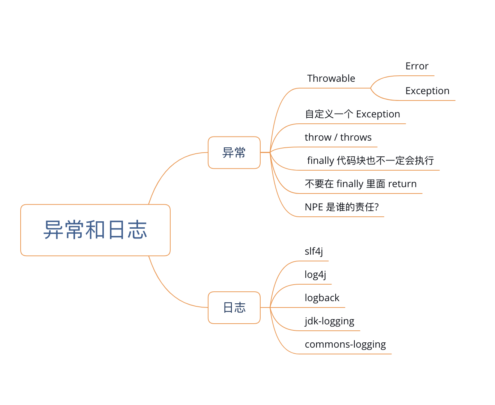

## 异常和日志




- 异常

  - 从 Java 类结构上看, 异常分为两类, 一个是 java.lang.Error 类 另一个是 java.lang.Exception 类. 他们都继承自 java.lang.Throwable 类

  - 从程序运行角度来看

    - Error 通常是致命异常. 比如 StackOverflowError / OutOfMemoryError. 出现这种情况说明系统出现了不可控的错误. 程序无法自行处理, 需要人工介入处理.
    - Exception 是非致命异常. 比如 ArrayIndexOutOfBoundsException / ClassNotFoundException 等

  - 从编码角度来看, Exception 分为 checked exception 和 unchecked exception. 

    - checked exception 又叫做受检异常. 这种异常在编码过程当中需要显示的处理, 比如 try-catch 或在方法上 throws 出去. 比如 ClassNotFoundException / SQLException. 因为这种异常如果不处理的话 编译器会提醒编程人员处理, 所以叫做受检异常.
    - unchecked exception 又叫做非受检异常, 或者叫做运行时异常, 这种异常都继承于 RuntimeException. 比如NullPointerException / ArrayIndexOutOfBoundsException 等.

  - throw / throws

    - throw 这是一个 java 语句. 用来向上抛出一个异常, 由调用者处理
    - throws 用在方法声明上. 其他地方调用这个方法时必须显示地处理. 也就是说throws 关键字声明的异常会在编译时被编译器注意到并提醒开发人员处理.

  - Try-catch-finally

    - 一般情况下, finally 的代码一定会被执行到除了以下三种情况:

      1. 没有进入 try 代码块
      2. try 代码块进入死循环或死锁状态
      3. 在 try 代码块中执行了 system.exit() 操作

    - finally 是在 return 之后执行的, 因此如果方法有返回值, 在 finally 代码块中对数据进行更改不会直接传递给被调用者 (看下面的例子 不过我认为一般情况下我们不会这么写的)

      ```java
      	public class Exceptions {
          private static int x = 0;
          public static void main(String[] args) {
              int m = returnBeforeFinally();
              System.out.println(m); // 1
          }
      
          private static int returnBeforeFinally() {
              try {
                  throw new Exception();
              } catch (Exception e) {
                  return ++x;
              } finally {
                  x = 1000; // 在 return 之后执行
              }
          }
      }
      ```

      

    - 不要在finally中进行 return, 容易使返回值的判断变的复杂.

      1. Try-catch-finally 如果在 try 和 catch 当中都有 return 的操作, 那么如果 try 代码块中没有出现异常则以 try 代码块中的 return 为最终返回值; 如果出现了异常则以 catch 代码块中的return结果为返回值
      2. 如果 try - catch - finally 中都有 return 操作. 那么情况就变成了: 如果 try 代码块中出现了异常, 则会执行 catch 代码块也会执行 finally, 最终以 finally 为准 (但这里要注意的是 catch 的代码块也被执行); 
      3. 但实际情况还是有可能出现这种情况的

  - NPE 是谁的责任? 书上明确说了 调用者负责处理方法的返回值为 null 的情况. 因为就算是方法在执行过程当中永远不可能返回 null, 但也无法排除由于其他原因比如网络不可用而导致的异常: 可能被调用的方法都没有被执行到. 而这一点是调用方所不容易感知的.

  - 自定义一个 Exception
    1. 继承于 Exception 类
    2. override 构造方法, 如果需要 message 则在自定义的构造方法中调用 super(message);

- 日志 (TBC - 1)


1. [关于日志](https://github.com/chinalwb/EasyCoding/issues/22)

-1-